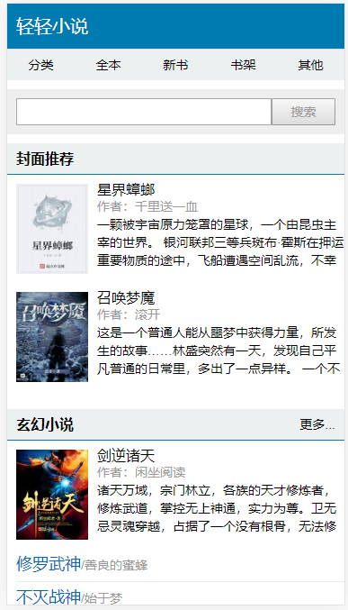

# freecms
FreeCms内容管理系统(学习项目),使用工具如下:

[beego](https://beego.me)

[gorm](https://github.com/jinzhu/gorm)

[gocolly/colly](https://github.com/gocolly/colly)

带一个小说模块

 

####安装
1.克隆到本地src目录

git clone https://github.com/yangyuanqi/free_cms.git

2.导入sql

3.修改conf配置

####网站地址
前台:localhost:8000

后台:localhost:8000/admin

账号:admin 密码:123456