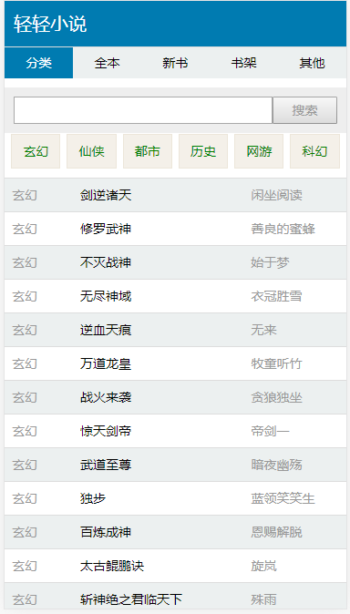

# freecms
FreeCms内容管理系统(学习项目),使用工具如下:

[beego](https://beego.me)  
[gorm](https://github.com/jinzhu/gorm)  
[gocolly/colly](https://github.com/gocolly/colly)  
[layui](https://www.layui.com/)  
[gjson](https://github.com/tidwall/gjson)  

####功能  
基础cms  
小说模块  
博客模块

 

#### 安装
1.克隆到本地src目录

git clone https://github.com/yangyuanqi/free_cms.git

2.导入sql  
/data/free_cms.sql

3.修改conf配置  
/conf/app.conf

#### 网站地址
前台:localhost:8000  

后台:localhost:8000/admin  

账号:admin 密码:123456  

[小说演示地址](http://book.yyq6.cn/book)  
[博客演示地址](http://book.yyq6.cn)